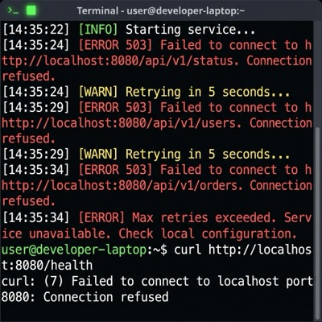

# Troubleshooting Common Issues

Encountering problems? Here are solutions for some common issues you might face while using EvOC.

## Issue 1: Error Immediately After Clicking "Get Started"

### Symptom

After accessing the EvOC web application and clicking the **`Get Started`** or **`Sign Up`** button on the homepage, you immediately see an error message, potentially similar to this:

### Cause

This often happens due to stale data stored in your web browser's cache from a previous visit or version of EvOC.

### Solution: Hard Refresh

The quickest solution is usually to perform a "hard refresh" of the page, which forces the browser to discard its cache and download the latest files from the server.

- **On most browsers (Windows/Linux):** Press `Ctrl` + `Shift` + `R`
- **On most browsers (Mac):** Press `Cmd` + `Shift` + `R` or `Cmd` + `Option` + `R`

Alternatively, you can try clearing your browser's cache specifically for the EvOC site through your browser's settings menu.

## Issue 2: Errors in Terminal Regarding Microservices (Local Install)

### Symptom

If you are running EvOC via a **local installation** (using Docker, etc.), you might see error messages appear in the terminal window where you launched the EvOC services. These errors often mention failures to connect to or fetch required microservices. The application UI might fail to load certain parts or become unresponsive. An example might look like this:

### Cause

This typically indicates that the different backend components (microservices) of your local EvOC installation cannot communicate properly, often due to network connectivity problems between your machine and the resources those services need (or sometimes between the services themselves if networking is misconfigured).

### Solution: Check Network & Restart

1.  **Verify Internet Connectivity:** Ensure the machine running EvOC has a stable and active internet connection. Try accessing other websites.
2.  **Check Network Configuration:** If using complex local network setups or VPNs, ensure they are not blocking communication required by EvOC's services.
3.  **Restart EvOC Services:** Stop the running EvOC services in your terminal (usually with `Ctrl` + `C`). Wait a few seconds, and then restart them using the standard launch command (e.g., `docker compose up -d`).
4.  **Retry:** Access the EvOC application interface again after restarting the services.

::: danger Persistent Issue?
If the problem continues after checking connectivity and restarting, consult the **[Local Installation Guide](./install/env-setup)** for more detailed setup verification steps or check for any specific network requirements mentioned there.
:::
