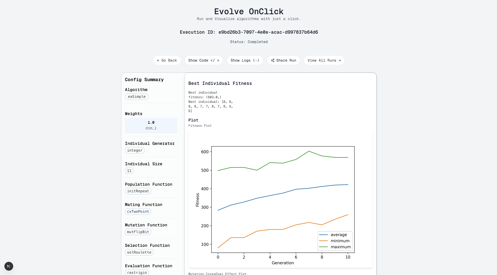

#  EvOC: Evolutionary Algorithms On Click

[](https://opensource.org/licenses/MIT)
[](https://vitepress.dev/)
[](http://makeapullrequest.com)

**EvOC** (Evolve On Click) is a powerful, user-friendly framework designed for visualizing and executing evolutionary algorithms with just a click. Whether you're a student, researcher, or educator, EvOC eliminates the coding barrier, allowing you to focus on the science of evolution.

---

## Key Features

- **Intuitive Configuration**: Visually set parameters for GA, GP, PSO, and ML Tuning through a sleek GUI.
- **Powerful Visualizations**: Instantly view fitness plots, GP trees, and PSO animations to understand your algorithm's behavior.
- **Code Generation**: Automatically generate clean, DEAP-based Python code from your configuration.
- **ML Tuning**: Optimize model hyperparameters and features effortlessly.
- **AI-Powered Explanations**: Integrated EvOC AI helps you understand complex concepts and generated code.
- **Cloud & Local**: Accessible via web app or local installation (Docker support).

---

## Preview

| Configuration | Visualization | AI Explanations |
| :---: | :---: | :---: |
|  |  |  |

---

## 🛠️ Technology Stack

This repository contains the **documentation site** for EvOC, built with:

- [**VitePress**](https://vitepress.dev/) - Static site generator designed for technical documentation.
- [**Vue.js**](https://vuejs.org/) - Powering the interactivity within the documentation.
- [**Markdown**](https://daringfireball.net/projects/markdown/) - For content creation.

---

## Getting Started

To run this documentation site locally:

1. **Clone the repository:**
   ```bash
   git clone https://github.com/Evolutionary-Algorithms-On-Click/user_docs.git
   cd user_docs
   ```

2. **Install dependencies:**
   ```bash
   npm install
   ```

3. **Start development server:**
   ```bash
   npm run docs:dev
   ```

4. **Build for production:**
   ```bash
   npm run docs:build
   ```

---

## Project Structure

```bash
user_docs/
├── .vitepress/        #VitePress configuration
├── public/            #Assets like images and logos
├── user-guide/        #Detailed guides for EA, ML tuning, etc.
├── install/           #Installation instructions
├── index.md           #Homepage
├── introduction.md    #Getting started guide
└── package.json       #Project dependencies
```

---

## Contributing

We welcome contributions! Please feel free to submit a Pull Request. For major changes, please open an issue first to discuss what you would like to change.

1. Fork the Project
2. Create your Feature Branch (`git checkout -b feature/AmazingFeature`)
3. Commit your Changes (`git commit -m 'Add some AmazingFeature'`)
4. Push to the Branch (`git push origin feature/AmazingFeature`)
5. Open a Pull Request

---

## License

Distributed under the MIT License. See `LICENSE` for more information.

---

## Meet the Team

Developed with ❤️ by the EvOC Team at Amrita School of Computing. Check out the [Team Page](./team.md) for more details.

---

<p align="center">
  <b>Built for the next generation of Evolutionary Computation</b><br>
  <a href="https://github.com/Evolutionary-Algorithms-On-Click">GitHub Organization</a>
</p>
